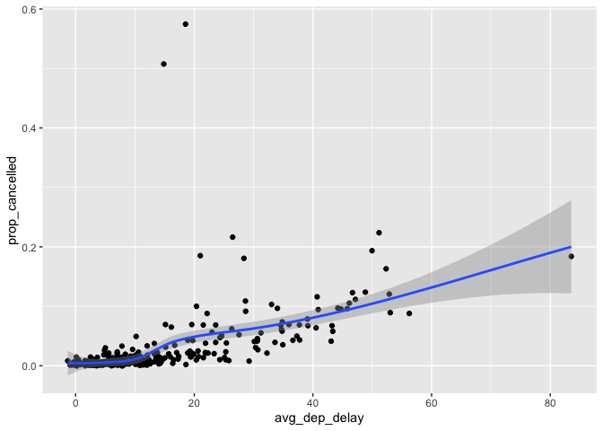

homework\_week3
================
Gigi Melone
9/27/2022

## Loading data and packages

``` r
library(dplyr)
```

    ## 
    ## Attaching package: 'dplyr'

    ## The following objects are masked from 'package:stats':
    ## 
    ##     filter, lag

    ## The following objects are masked from 'package:base':
    ## 
    ##     intersect, setdiff, setequal, union

``` r
#install.packages("nycflights13")
library(nycflights13)
library(ggplot2)
```

Question 1: How many flights have a missing dep\_time? What other
variables are missing? What might these rows represent?

``` r
#missing dep time will be NA, so I will look for NA (is.na = TRUE), and then use n() to find the number of missing departure times. 

flights %>% 
  mutate(missing_dep_time = is.na(dep_time)) %>% 
  filter(missing_dep_time == TRUE) %>% 
  summarise(missing_dep_time = n())
```

    ## # A tibble: 1 x 1
    ##   missing_dep_time
    ##              <int>
    ## 1             8255

Answer: 8255 flights are missing dep\_time. When dep\_time is missing,
so are other variables corresponding to flight departure/arrival stats
(including departure delay, arrival time, arrival delay, and air time).
Variables for scheduled arrival/departure time and flight distance are
not missing. I believe the missing rows are present because the flight
was cancelled.

Question 2: Currently dep\_time and sched\_dep\_time are convenient to
look at, but hard to compute with because they’re not really continuous
numbers. Convert them to a more convenient representation of number of
minutes since midnight.

``` r
#since midnight: 2400 is 1440, add 100 %% 1440 because that's 0 
flights %>% 
  mutate(dep_time_conv = (dep_time %/% 100 * 60 + dep_time %% 100) %% 1440, sched_dep_time_conv = (sched_dep_time %/% 100 * 60 + sched_dep_time %% 100) %% 1440) %>%
  select(sched_dep_time, sched_dep_time_conv, dep_time, dep_time_conv)
```

    ## # A tibble: 336,776 x 4
    ##    sched_dep_time sched_dep_time_conv dep_time dep_time_conv
    ##             <int>               <dbl>    <int>         <dbl>
    ##  1            515                 315      517           317
    ##  2            529                 329      533           333
    ##  3            540                 340      542           342
    ##  4            545                 345      544           344
    ##  5            600                 360      554           354
    ##  6            558                 358      554           354
    ##  7            600                 360      555           355
    ##  8            600                 360      557           357
    ##  9            600                 360      557           357
    ## 10            600                 360      558           358
    ## # … with 336,766 more rows

Question 3: Look at the number of canceled flights per day. Is there a
pattern? Is the proportion of canceled flights related to the average
delay? Use multiple dyplr operations, all on one line, concluding with
ggplot(aes(x= ,y=)) + geom\_point()

``` r
#H1: greater delays equate to greater cancellations 
delayed_flights_trend <- flights %>% 
  mutate(cancelled = is.na(dep_time) & is.na(arr_time)) %>% 
  group_by(year, month, day) %>% 
  summarise(prop_cancelled = mean(cancelled), avg_dep_delay = mean(dep_delay, na.rm = T), avg_arr_delay = mean(arr_delay, na.rm = T)) 
```

    ## `summarise()` regrouping output by 'year', 'month' (override with `.groups` argument)

``` r
#plot average delays by proportion cancelled
ggplot(data = delayed_flights_trend, aes(x = avg_dep_delay, y = prop_cancelled)) + geom_point() + geom_smooth()
```

    ## `geom_smooth()` using method = 'loess' and formula 'y ~ x'

<!-- -->

``` r
#accept H1, there is a positive realtionship with length of departure delay and proportion of flights cancelled 
```

Answer: The proportion of cancelled flights is related to average delay,
with the proportion of cancelled flights increasing as departure delay
increases
